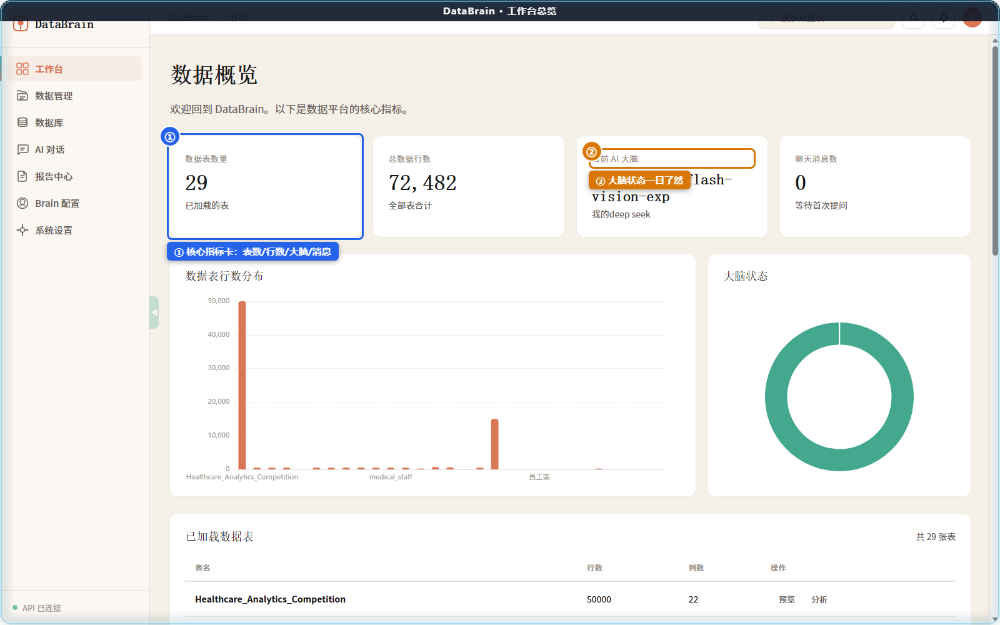
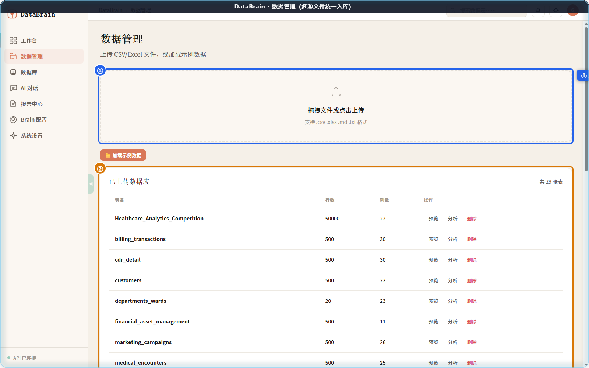
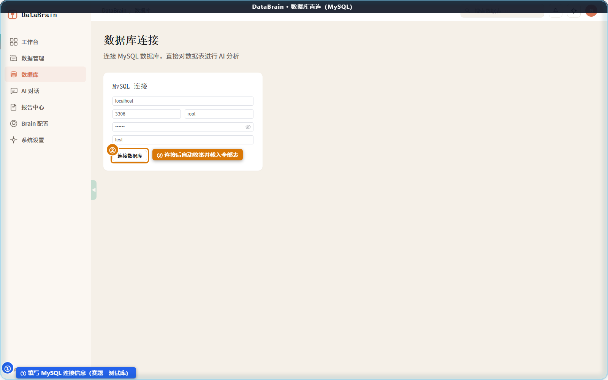
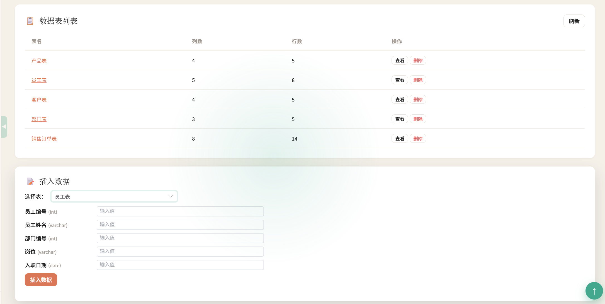
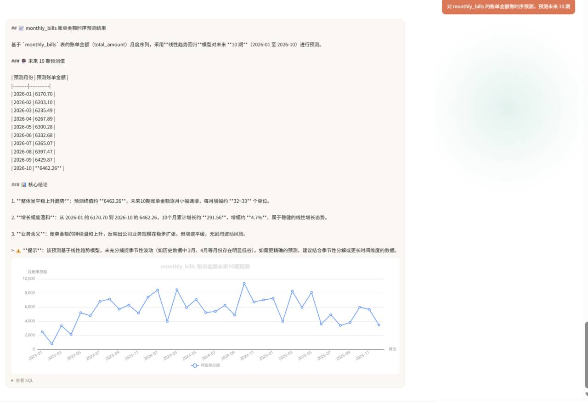
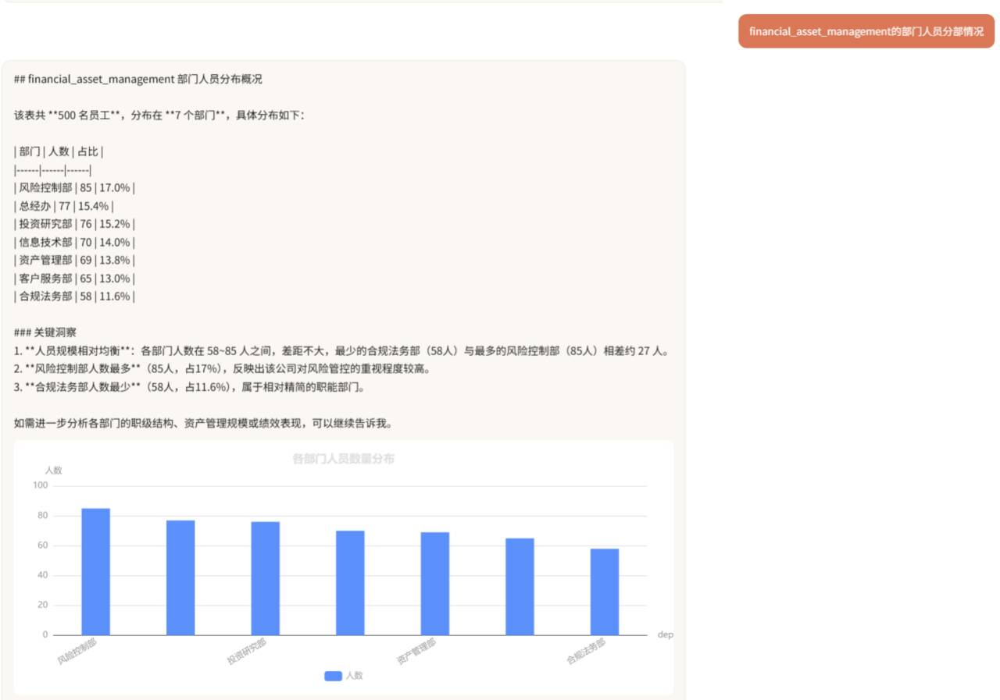
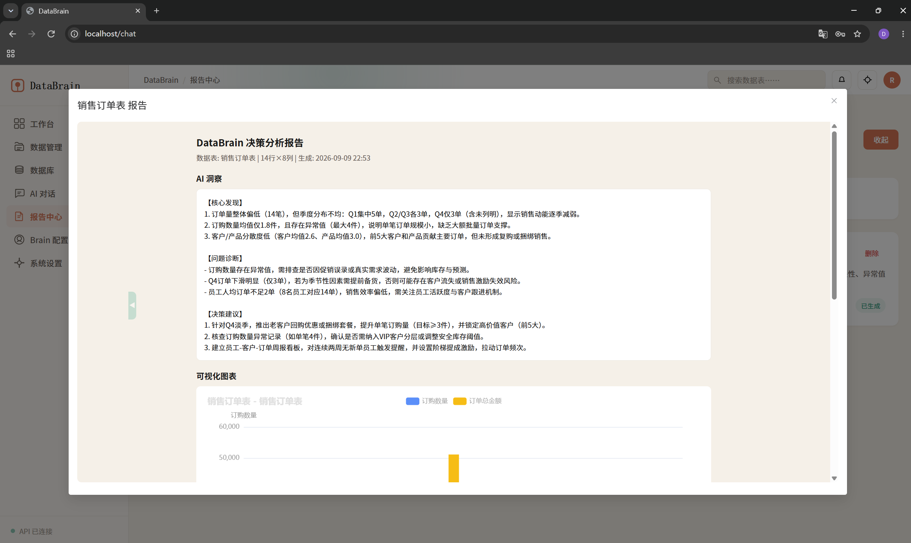
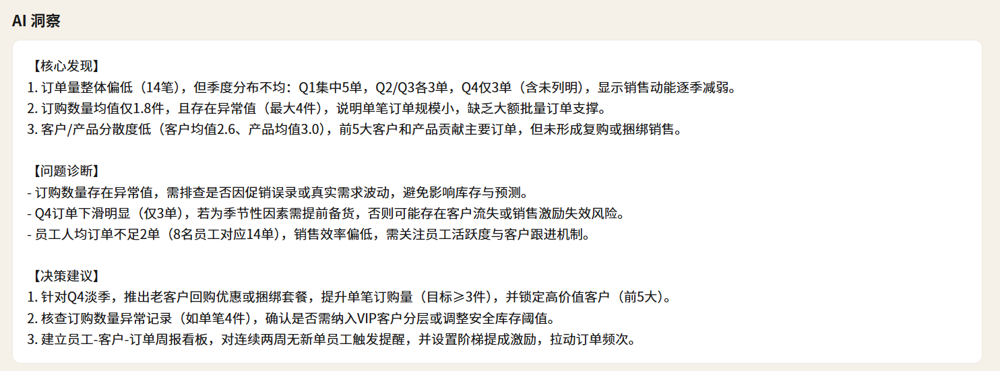
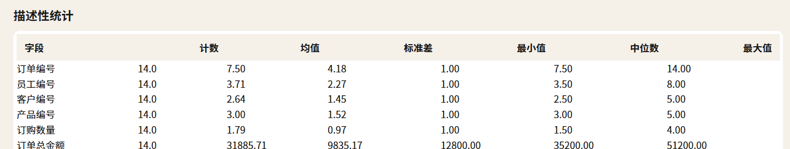
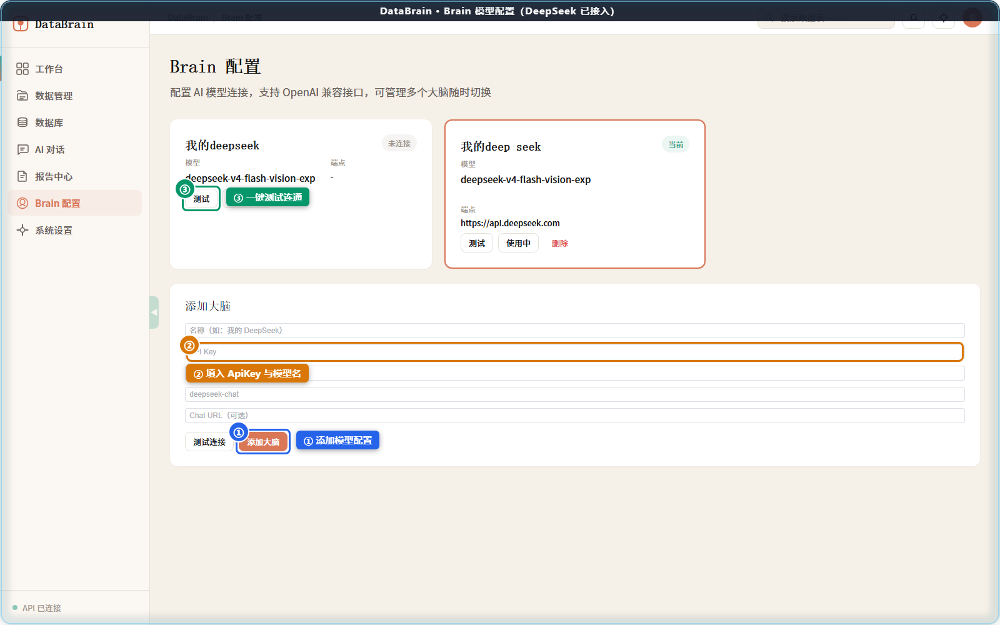

<div align="center">

# DataBrain

**智能数据探索新纪元 · 用自然语言对话，完成数据科学分析**

[](https://www.python.org/)
[](https://fastapi.tiangolo.com/)
[](https://vuejs.org/)
[](LICENSE)

一句话提问，自动完成 **查 → 算 → 画 → 报** 全流程

</div>

---

## 目录

- [项目简介](#项目简介)
- [核心痛点与解法](#核心痛点与解法)
- [系统架构](#系统架构)
- [核心技术方案](#核心技术方案)
- [功能演示](#功能演示)
- [实测准确性](#实测准确性)
- [快速开始](#快速开始)
- [目录结构](#目录结构)
- [技术栈](#技术栈)
- [已知限制](#已知限制)
- [未来展望](#未来展望)

---

## 项目简介

**DataBrain** 是一款面向业务人员的智能数据分析系统。用户通过日常语言提问，系统自动完成数据查询、统计分析、图表生成和报告撰写全流程，彻底摆脱对 SQL 编程和专业 BI 工具的依赖。

系统核心采用 **Agent 循环框架**，大语言模型充当调度中枢，自主决策何时查询数据、何时做统计分析、何时生成图表、何时输出报告。技术层面融合 Text2SQL 自动查询、多源数据统一接入、智能可视化匹配、决策报告自动生成、非结构化文档检索、历史记忆复用以及多模型热切换等能力。

> **核心价值**：把数据分析的响应周期从「按天计算」缩短到「按分钟计算」。

## 核心痛点与解法

传统数据分析面临三重困境，DataBrain 逐一破解：

| 痛点 | 传统方式 | DataBrain 解法 |
|------|---------|---------------|
| **数据散** | 业务数据散落于 MySQL、PostgreSQL、Excel、CSV、Word、PDF，跨源关联靠人工搬运 | 七类数据源统一接入，同一 SQL 引擎跨源联合查询 |
| **流程长** | 提需求 → 工程师写 SQL → Excel 手工分析 → PPT 汇报，链路以「天」计 | 自然语言提问，Agent 自动编排全流程，分钟级出结果 |
| **工具僵** | 传统 BI 交互固定、多轮追问困难、分析成果碎片化 | 多轮对话深入探索，图表与报告一键直出 |

**三大核心能力协同**：

- **Agent 自主编排** —— 大模型作为决策中枢，自己决定先查什么、再算什么，串起「查 → 算 → 画 → 报」全过程
- **Text2SQL 精准取数** —— 把表结构与字段含义一起交给模型，让它写出能跑通的 SQL
- **RAG 文档检索** —— 把 Word / PDF / MD 等文档切段入库，用语义检索回答非结构化问题

## 系统架构

系统采用**五层递进架构**，四项能力纵向贯穿全流程：

```
┌─────────────────────────────────────────────────────────────┐
│  L1  前端展示层    Vue 3 + Element Plus · ECharts · three.js │
├─────────────────────────────────────────────────────────────┤
│  L2  后端服务层    Python 3.12 · FastAPI · uvicorn           │
├─────────────────────────────────────────────────────────────┤
│  L3  智能中枢层    Agent 主循环（查数据·做统计·画图表·出报告）│
├─────────────────────────────────────────────────────────────┤
│  L4  数据层        SQLite 多表统一存储 · _meta 元数据管理     │
├─────────────────────────────────────────────────────────────┤
│  L5  数据源接入层  CSV · Excel · MD · TXT · SQLite · MySQL · PG│
└─────────────────────────────────────────────────────────────┘
        贯穿全流程：多大脑接入 · 记忆机制 · 数据画像 · 部署运维
```

### 稳定运行的四道保障

| 保障 | 问题 | 对策 |
|------|------|------|
| **数据不丢失** | 服务重启后数据消失 | 所有表持久化到磁盘 SQLite，`_meta` 表统一管理表结构、行数与来源 |
| **接口不报错** | 统计结果含 NaN/Infinity 导致 500 | `SafeEncoder` 递归清理非法数值 |
| **模型随时可换** | 换模型需改代码重启 | `BrainManager` 适配器模式封装厂商协议，界面切换立即生效 |
| **调用不怕抖动** | 网络抖动/限流中断任务 | 所有模型调用统一走 httpx：3 次重试 + 60s 超时 |

## 核心技术方案

### 1. Agent 主循环：六步闭环，轮次自适应

```
① 准备上下文  →  ② 回忆相似问法  →  ③ 大模型思考
                                        ↓
⑥ 输出并记住  ←  ⑤ 整理结果  ←  ④ 调用工具（查·算·画·报·搜）
                                        ↑
                        ⑤ 判断还需继续时回到 ③（最多 8–50 轮）
```

**轮次按问题复杂度自适应**，既防止简单问题浪费令牌，也避免复杂任务中途中断：

| 问题类型 | 轮次上限 | 问题类型 | 轮次上限 |
|---------|---------|---------|---------|
| 列举类 | 8 | 关联对比类 | 25 |
| 统计聚合类 | 15 | 报告预测类 | 40 |
| — | — | 复合分析类 | 50 |

**安全护栏**：只执行 SELECT 查询（写操作一律拦截）· 结果最多 500 行超出自动截断 · 报错自动改写重试 · NaN/±Infinity 统一兜底

### 2. Text2SQL：让大模型写出能跑通的 SQL

**四步生成链路**：

1. **先看懂表结构** —— `DataProfiler` 生成字段画像（字段名、类型、空值率、示例值、业务含义推测），与表结构一起写进提示词
2. **生成 SQL 语句** —— 大模型结合表结构、字段含义与历史相似问法输出 SQL
3. **校验后执行** —— 正则白名单只放行 `SELECT`；查询结果上限 500 行
4. **出错自动重试** —— SQL 报错时把原始错误信息回传模型，自动改写后重试

```sql
-- 提问：各城市销售额排名前 10
SELECT city, SUM(amount) AS total
FROM orders
GROUP BY city
ORDER BY total DESC
LIMIT 10
```

**双引擎架构**：上传的文件（CSV/Excel/MD/TXT）先存入 SQLite 再查询；直连的 MySQL/PostgreSQL 走原生驱动查询。对用户来说，两种来源都是同一句中文提问。

### 3. 多数据源适配：七类数据源统一接入

| 接入方式 | 支持类型 | 特性 |
|---------|---------|------|
| **文件上传** | CSV · Excel · Markdown · TXT | 分块流式导入（5000 行/块），实时进度反馈 |
| **数据库直连** | SQLite · MySQL · PostgreSQL | 连接后自动枚举全部库表，批量加载 |

- **同质化处理**：所有表统一存入 SQLite，元数据由 `_meta` 表管理
- **语义画像**：`DataProfiler` 自动识别「手机号」「订单金额」等业务含义，辅助跨表 JOIN
- **编码自适配**：CSV 自动探测编码（UTF-8/GBK/GB18030）与分隔符（逗号/分号/制表符/竖线）

### 4. 智能可视化：AI 自适应选图

`「维度基数 × 度量数量 × 字段类型」` 三要素决定图型，无需手动选择：

| 图型 | 适用场景 | 选图规则 |
|------|---------|---------|
| **柱状图** | 多类别单度量对比 | 维度基数适中 · 单度量 |
| **折线图** | 时间序列趋势 | 检测到时间字段优先趋势线 |
| **环形图** | 构成占比 | 维度基数小 · 展示占比 |
| **散点图** | 双度量相关性 | 两个数值度量 |

> **数据真实性保障**：图表直接使用前序查询返回的真实结果渲染，后端仅下发 ECharts option JSON，前端零配置渲染，保证「数据 — 图表」严格同源，杜绝大模型虚构数据点。

### 5. 记忆与画像：三套机制越用越准

- **模式记忆** —— 把成功过的 SQL 存成模板（SQL 模板化：字面量替换为占位符），相似提问直接套用
- **用户偏好** —— 记住常用提问方式与展示习惯
- **数据画像** —— 缓存表画像，避免重复分析开销

**相似度打分规则**（综合排序取最相似 2 条）：

```
同表匹配 ×2.0  +  关键词重叠 ×3.0  +  查询类型一致 ×1.5  +  使用频次 ×0.1
```

采用 LRU 策略保留最近 30 条高频记录。

### 6. 多「大脑」可切换：界面上点一下立即生效

`BrainManager` 用适配器模式屏蔽不同厂商 API 差异，内置多种预设配置：

**DeepSeek** · **通义千问** · **文心一言** · **OpenAI** · **Ollama 本地部署** · **自定义端点**

换模型不用改代码、不用重启服务。企业可以日常查询用低成本模型，复杂分析切高性能模型，也可在公有云 API 与本地私有化部署间自由切换。

### 7. 非结构化数据问答：分集施策

| 数据形态 | 检索策略 |
|---------|---------|
| 表直查（ID 分隔格式） | 按 `=== ID ===` 解析，从提问中提取 ID 精确查找 |
| 表领域操作 | ID 直查 + 关键词匹配 |
| 多步语义检索（大文件） | 嵌入向量缓存 + 相似度排序，避免全文件扫描 |

## 功能演示

### 工作台总览

一屏掌握数据资产与大脑状态：数据表数量、总行数、当前 AI 大脑、API 连接状态、数据表清单与规模可视化。



### 数据管理：拖拽上传，逐表可操作

支持拖拽与点选两种上传方式，CSV / Excel / MD / TXT 均可。每张已上传表带「预览 / 分析 / 删除」操作，上传过程实时显示进度。



### 数据库直连：填参数 → 枚举库表 → 在线建表插数

填写主机、端口、账号等参数一键连接，成功后自动列出全部数据库与数据表；支持可视化建表与表单式插入数据，全程无需手写 DDL / DML。





### AI 对话：一句自然语言，直出 SQL + 结果表 + 图表

**场景一 · 时间序列预测** —— 检测到时间字段，优先趋势线：

> 「对 monthly_bills 的账单金额做时序预测，预测未来 10 期」→ SQL + 折线图 + 关键洞察



**场景二 · 多类别对比** —— 类别基数适中，排序柱状图：

> 「financial_asset_management 的部门人员分部情况」→ SQL + 柱状图 + 占比表 + 关键洞察



### 决策报告：点一下就出完整 HTML 报告

报告固定包含四段内容：

| 段落 | 内容 |
|------|------|
| **AI 洞察** | 基于数据生成核心发现、问题诊断、决策建议 |
| **可视化图表** | 依据数据特征自动选 bar / line / pie / scatter |
| **描述性统计** | 数值列 count / mean / std / 四分位 / max |
| **异常值检测** | IQR 法逐列扫描，标出异常点与上下文 |







### 多模型配置：换模型不重启

界面填写名称、接口地址、API 密钥与模型标识，点击测试确认连通后启用，立即生效。



## 实测准确性

在赛题样例题集上实测 **1467 道题**：

| 指标 | 结果 | 说明 |
|------|------|------|
| **结构化 · SQL 执行成功率** | **100%** | 680 / 680 题全部跑通 |
| **非结构化 · 答案正确率** | **94.5%** | 744 / 787 题回答正确 |
| **总体成功率** | **97.1%** | 1424 / 1467 题成功完成 |

**结论**：结构化题集（金融 / 医疗 / 通信三个领域）全部零失败；非结构化题集受长文档语义消歧影响，仍稳定在 92% 以上。完整覆盖赛题全部必选项与三个可选项。

## 快速开始

### 环境要求

- Python 3.10+（开发验证于 3.12）
- 可访问大模型 API 的网络环境（使用 Ollama 本地模型可完全离线）

### 1. 安装依赖

```bash
pip install -r backend/requirements.txt
```

### 2. 配置模型

启动后进入「Brain 配置」页面，填写模型信息；或直接编辑 `backend/brain_configs.json`：

```json
{
  "configs": [
    {
      "id": "default",
      "name": "deepseek",
      "adapter_type": "openai_compatible",
      "provider": "custom",
      "api_key": "你的API密钥",
      "base_url": "https://api.deepseek.com",
      "model": "deepseek-chat"
    }
  ],
  "active_id": "default"
}
```

### 3. 启动

**方式一：分别启动**

```bash
# 后端（默认 8502 端口）
python backend/main.py

# 前端：用任意静态服务器托管 frontend/dist
python -m http.server 80 --directory frontend/dist
```

**方式二：绿色包一键启动**（若使用完整发布包）

```bash
start-all.bat    # 自动拉起后端(8502) + 前端(80)，并打开浏览器
stop.bat         # 一键停止
```

### 4. 使用流程

```
① 注册并登录系统账号
② 「Brain 配置」添加模型并测试连通性
③ 「数据管理」上传 CSV/Excel，或「数据库」直连 MySQL/PostgreSQL
④ 「AI 对话」用自然语言提问，即刻获得洞察
```

- 前端入口：`http://localhost`
- 后端 API：`http://localhost:8502`
- 在线 API 文档（Swagger）：`http://localhost:8502/api/docs`

> 默认管理员账号 `admin` / `123`，**请首次登录后立即修改**。

## 目录结构

```
backend/
├── main.py                  # FastAPI 入口（含 SafeEncoder）
├── auth.py                  # 用户认证与权限
├── shared_state.py          # 全局状态单例
├── brain_configs.json       # 模型配置（填自己的 API Key）
├── api/
│   ├── server.py            # 路由注册
│   └── routers/
│       ├── auth.py          # 登录 / 注册 / 用户管理
│       ├── data.py          # 数据上传 / 表管理 / 查询 / 分析 / 报告
│       └── brain.py         # 模型配置管理
├── agent/
│   ├── service.py           # Agent 主循环（ReAct）
│   ├── registry.py          # 工具注册中心
│   └── tool_schemas.py      # 工具 Schema 定义
├── core/
│   ├── agent.py             # Agent 核心逻辑与系统提示词
│   ├── llm_client.py        # LLM 客户端（3 次重试 + 60s 超时）
│   └── tool_schemas.py      # OpenAI 函数调用格式 Schema
├── brain/                   # 模型适配器（适配器模式）
│   ├── manager.py           # BrainManager：统一管理与热切换
│   ├── base.py              # 适配器基类
│   └── adapters/
│       ├── openai_compatible.py
│       ├── ollama.py
│       └── wenxin.py
├── memory/
│   ├── data_engine.py       # SQLite 多表存储引擎
│   ├── csv_adapter.py       # CSV 编码 / 分隔符自动探测
│   ├── data_profiler.py     # 字段画像与业务含义推断
│   ├── db_connector.py      # MySQL / PostgreSQL / SQLite 连接器
│   ├── pattern_memory.py    # 模式记忆（四维评分检索）
│   └── preferences.py       # 用户偏好
├── tools/                   # 工具集
│   ├── query.py             # Text2SQL 查询执行
│   ├── analyze.py           # 统计分析（6 类算子）
│   ├── visualize.py         # 图表配置生成
│   ├── report.py            # 决策报告生成
│   ├── statistical.py       # 假设检验（T检验/ANOVA/回归/卡方）
│   └── knowledge.py         # 非结构化文档检索
├── data_analyzer/           # 分析核心与报告模板
├── config/storage.yaml      # 存储策略配置
└── tests/                   # 回归测试

frontend/
└── dist/                    # 前端构建产物（Vue 3 SPA）
```

## 技术栈

| 层次 | 技术选型 |
|------|---------|
| **前端** | Vue 3 · Element Plus · Apache ECharts · three.js（首页 3D 背景） |
| **后端** | Python 3.12 · FastAPI · uvicorn（自带 Swagger 文档） |
| **数据引擎** | SQLite（统一存储）· pandas · NumPy · openpyxl |
| **数据库直连** | PyMySQL · psycopg2 · SQLAlchemy |
| **模型接入** | httpx 客户端（3 次重试 + 60s 超时） |
| **部署** | nginx 反向代理 + 内嵌 Python 运行时（免安装绿色部署） |

## 已知限制

- **CSV 编码探测**窗口为文件前 256KB，混合编码的大文件（前半 ASCII、后半 GBK）可能解析失败
- **前置说明行**的 CSV（首行非表头）需手动处理后上传
- **千分位数字**（如 `"1,234.56"`）按文本存储，不做数值转换
- **查询结果上限 500 行**，超出自动截断
- 非结构化长文档检索受语义消歧影响，正确率约 94.5%

## 未来展望

| 方向 | 规划 |
|------|------|
| **自动数据建模深化** | 时序预测（ARIMA / Prophet）+ 异常检测算法库 |
| **RAG 强化** | 引入 FAISS 向量库，支持百万级文档检索 |
| **权限与审计** | 多租户行级权限、SQL 审计日志 |
| **多模态报表** | Word / PDF 导出，图表可交互下钻 |

## License

[MIT](LICENSE)
